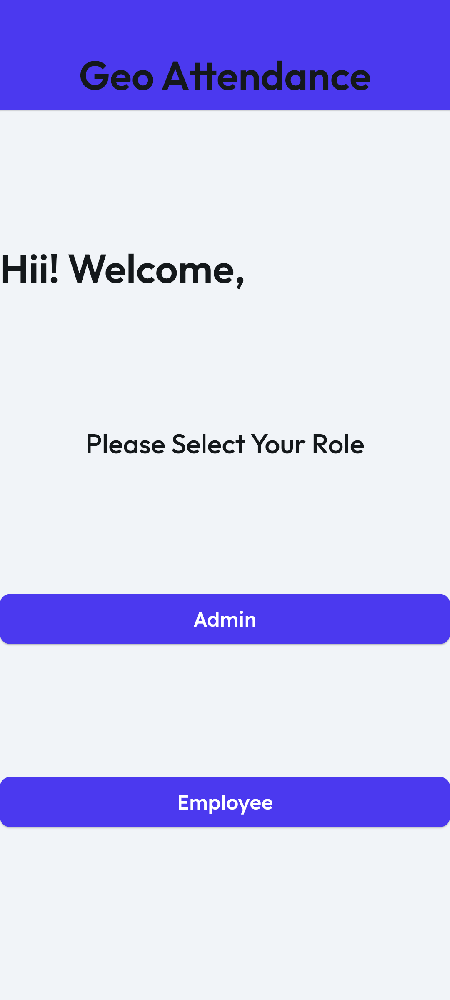
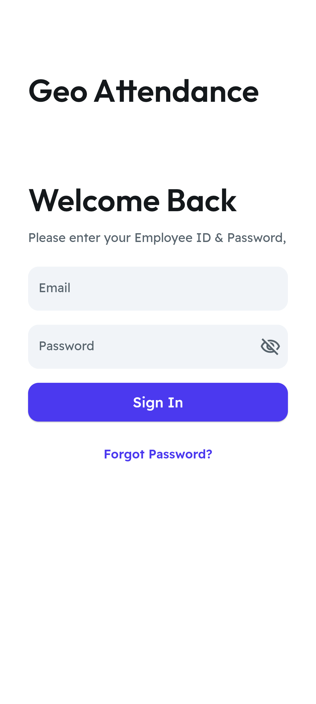
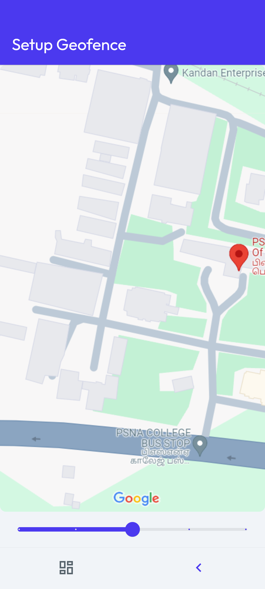
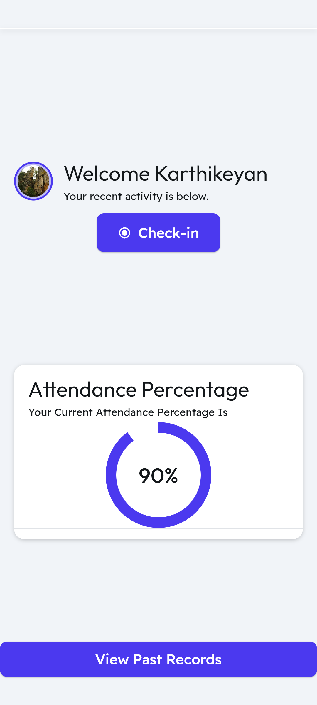
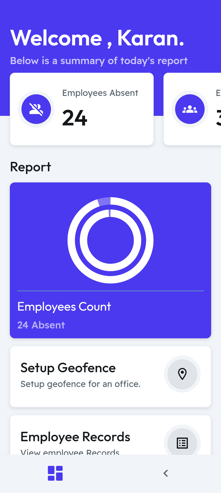

# Geo-Attendance – Location-Based Attendance System 📍

A mobile application built using **Flutter** that allows employees or students to mark their attendance based on live geolocation. The system uses **geo-fencing** to validate presence within approved boundaries, eliminating proxy attendance and enhancing institutional transparency.

> 🚫 **Note**: This repository currently showcases the design and workflow of the app through screenshots. The source code is unavailable due to system reset and archival loss. A minimal rebuilt version may be added later.

---

## 💡 Features

- 🔐 Secure login for employees/students and admins
- 🗺️ Geo-fenced attendance marking
- 📊 Dashboard for admins to monitor daily logs
- ⏱️ History view for employees (past attendance)
- 🔄 Real-time location checks and validations
- ✅ Built with Flutter + Firebase

---

## 🧪 Tech Stack

- **Frontend**: Flutter (Dart)
- **Backend**: Firebase Auth, Cloud Firestore
- **APIs**: Geolocation, Geofencing

---

## 📸 Screenshots

### 🏠 Home Page  

### 🔐 Employee Login  

### 🗺️ Geo-Fence Detection  

### 📅 Employee Dashboard  

### 📂 Past Attendance Logs  

### 📊 Admin Dashboard  

---

## 🏆 Achievements

- 🥇 **Finalist – 5G & 6G Hackathon 2024**
- 🥈 **Semifinalist – Smart India Hackathon (SIH) 2024**

---

## 🧭 Status

- 📁 **Code**: Currently unavailable  
- 📷 **Screenshots**: Added  
- 🔧 Planned: Rebuilding core functionality for demo use

---

## 📬 Contact

**Karan N.**  
📧 karann23cb@psnacet.edu.in  
🌐 [LinkedIn](#) | [GitHub](https://github.com/KaranMishra22)

---

